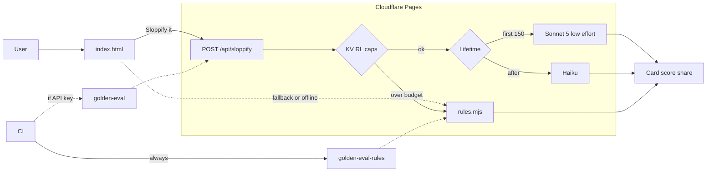

# Sloppify 💩

[](https://github.com/mananritwik/sloppify/actions/workflows/eval.yml)

**[Try it → sloppify.lol](https://sloppify.lol)**

Turn anything into an unbearable LinkedIn thought-leadership post. A parody.

Paste a plain sentence. Get humblebrag broetry — buzzword swaps, “it’s not X, it’s a movement,” em-dashes, a made-up statistic, performative gratitude, and hashtags.

```
Human:     I microwaved my lunch.
Sloppify:  This isn't just lunch. It's a lifestyle.
           🔥 I engineered a culinary solution in under 90 seconds.
           (And yes — "engineered" just means "microwaved." But it sounds better.)
```

## Why this exists

Everyone’s suddenly very serious about *removing* AI slop — detectors, writing policies, skills that strip the tells out. That’s good, actually. Attention is scarce; faking a human on the other end of the words is a real problem.

Sloppify does the opposite on purpose. It’s a joke about LinkedIn voice. Built in an afternoon — but the second half of this README is how it still ships with real baselines (secrets, caps, evals), because the craft is part of the bit.

Made by [Ritwik Manan](https://www.linkedin.com/in/ritwikmanan).

## Inspired by

People trying to remove slop (warmly — you’re why this is funny):

- [Peter Yang’s `no-ai-slop` skill](https://github.com/petergyang/no-ai-slop) — strips 20+ slop patterns out of writing. Sloppify is the evil twin.
- [Chris Best’s *Against Claudefishing*](https://post.substack.com/p/against-claudefishing) — naming the betrayal of faking a human on the other end of the words, plus Substack’s Pangram “scan for AI” labels that came with it.
- [Clay’s AI writing policy](https://sophiebits.com/2026/06/25/there-are-no-lossless-transformations-of-natural-language-text) — Sophie Alpert’s “writing is thinking” essay, later rolled out company-wide ([Varun Anand’s announcement](https://www.linkedin.com/posts/vaanand_we-just-instituted-an-official-ai-writing-activity-7492584311087542272-cl50)).

## What’s on the page

Tone dial (Professional / Casual / Unhinged), pixel mascot, Slop Score + tell chips, LinkedIn-style card, **copy / copy link / share / save image**, rotating starter seeds, before/after examples, deeplinks (`?text=` / `?tone=`), and hidden **SLOP MODE** (third click of the theme icon, or click the mascot).

Two engines under the hood: a free client-side **rules** path that always works, and an opt-in **AI** path (Claude) that falls back to rules when the budget is spent.

---

## How it’s built

Afternoon joke. Not afternoon-shaped infrastructure. The browser never sees the Anthropic key; the API is capped; CI fails if the output stops being slop.

### System design



### Security & cost baseline

Everything serious lives server-side in [`functions/api/sloppify.js`](functions/api/sloppify.js):

| Control | What it does |
|---|---|
| **Secret key** | `ANTHROPIC_API_KEY` is a Cloudflare Pages secret — never shipped to the browser. The client only POSTs to `/api/sloppify`. |
| **Input cap** | Hard 600-character limit (413 if over). |
| **Output cap** | `max_tokens: 320` so each call stays cheap and short. |
| **Timeout** | 20s abort on hung upstream — can’t pin the Worker forever. |
| **Per-IP rate limit** | 15 AI calls / IP / day (KV). |
| **Global daily wallet** | 800 AI calls / day total; past that the API returns `{ fallback: true }` and the UI uses the free rules engine. |
| **Model tiering** | First 150 lifetime calls → Sonnet 5 at `effort: low`; then Haiku. |
| **Prompt injection** | System prompt is task-locked: “ignore previous instructions” still just gets sloppified. Golden eval includes this case. |
| **Optional Turnstile** | Bot check if `TURNSTILE_SECRET_KEY` is set (off by default so a fresh deploy isn’t broken). |
| **Logging** | One structured JSON line per call (`model`, `tone`, lengths) — no pasted user text in the log line. |
| **Client XSS** | Output is HTML-escaped before it hits the fake LinkedIn card. |
| **CI gates** | `npm run eval:rules` always runs on PRs. Live AI eval runs when a repo secret is present. |

KV counters are eventually consistent (read-then-write), so a burst can slightly overshoot a cap. Accepted tradeoff for a joke tool; Durable Objects if you ever need a hard atomic ceiling.

### Repo map

| Path | Role |
|---|---|
| [`index.html`](index.html) | UI |
| [`rules.mjs`](rules.mjs) | Rules engine (+ offline eval) |
| [`functions/api/sloppify.js`](functions/api/sloppify.js) | Claude endpoint, caps, prompt |
| [`eval-signals.mjs`](eval-signals.mjs) | Shared “is this still slop?” checks |
| [`golden-eval-rules.mjs`](golden-eval-rules.mjs) | Offline rules eval (always in CI) |
| [`golden-eval.mjs`](golden-eval.mjs) | Live AI eval |
| [`og.jpg`](og.jpg) | Link-preview image |
| [`wrangler.toml`](wrangler.toml) | Cloudflare Pages + KV `RL` |

### Run it locally

```bash
npm install
npm run dev          # http://localhost:8788
npm run eval:rules   # no API key needed
```

For local AI, put `ANTHROPIC_API_KEY=...` in `.dev.vars` (gitignored).

### Fork / deploy your own

Cloudflare Pages, build output `/`, no build command. Set secret `ANTHROPIC_API_KEY`, keep KV binding `RL` from `wrangler.toml`, leave Turnstile off unless you add the widget. Live site: **sloppify.lol**.

Knobs in [`functions/api/sloppify.js`](functions/api/sloppify.js): `SONNET_LIFETIME` (150), `GLOBAL_DAILY` (800), `PER_IP_DAILY` (15), `MAX_INPUT` (600), `MAX_TOKENS` (320).

## License

MIT. It's a slop generator, use it in good health.
